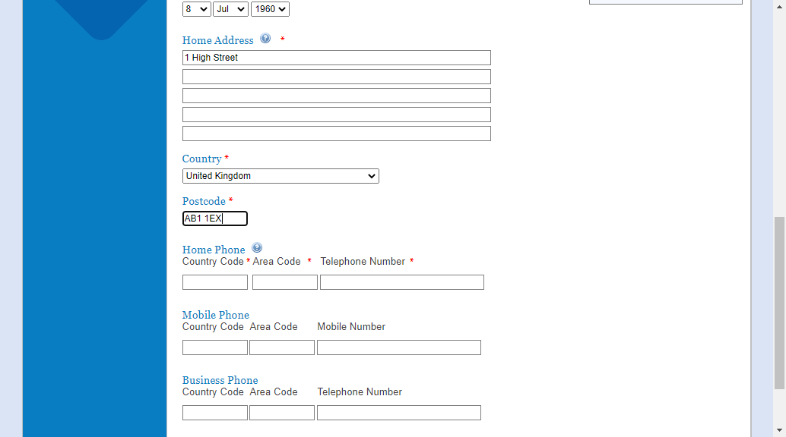

Test cases
==========

Workflow tests
--------------

This is an example of a documented system which is also an executable test.

The idea is that it can contain information about the tests - their purpose and scope.

It can also be used to document the system under test.

For example, in could contain links to other resources: https://portal.jerseyfsc.org 
and images

.. code:: robotframework

    *** Settings ***
    Documentation     A test suite with a single test for valid homepage.
    ...
    ...               This test has a workflow that is created using keywords in
    ...               the imported resource file.
    Resource          resources.robot

    *** Test Cases ***
    Homepage Is Valid
        Open Browser To Home Page
        Homepage Should Be Open
        Homepage Links Should Be Valid
        [Teardown]  Close Browser

    New User Can Register
        Open Browser To Home Page
        Click Register Link on Homepage
        Fill In Register Form with Happy Path Details
        Check Registration Complete
        [Teardown]  Close Browser
        
You can write whatever you want to document both the tests and the system under test
This will allow a broad audience to read it and gain confidence in the work done